# 👋 Hi, I'm Dhruv Khare

### 💻 Computer Science Student | Software Developer

I’m a **B.Tech Computer Science & Engineering student at ABES Engineering College** who enjoys building practical software systems and solving real-world problems through code.

My interests include **full-stack development, backend engineering, APIs, Data Structures & Algorithms, and AI-powered automation**.

<p align="left">
  <a href="https://linkedin.com/in/dhruvkhare-softwaredev">
    
  </a>
  <a href="https://leetcode.com/u/dhruvkhare536/">
    
  </a>
  <a href="https://github.com/Dhruv-Khare">
    
  </a>
</p>

---

## 🚀 About Me

- 🎓 B.Tech CSE student at **ABES Engineering College**
- 💻 Interested in **full-stack and backend development**
- 🤖 Exploring **AI APIs, automation workflows, and intelligent applications**
- 🧩 Regularly practicing **Data Structures & Algorithms**
- 🛠️ Enjoy building projects that combine **APIs, databases, automation, and AI**
- 📚 Currently strengthening my skills in **system design, backend architecture, and problem solving**

---

## 🛠️ Tech Stack

### Languages

<p>
  
</p>

### Frontend

<p>
  
</p>

### Backend

<p>
  
</p>

### Databases & Infrastructure

<p>
  
</p>

### Tools & Platforms

<p>
  
</p>

### AI & Automation

<p>
  
  
  
</p>

`Gemini` · `Claude` · `n8n`

---

## 🔥 Featured Projects

### ✈️ [TravelOS](https://github.com/Dhruv-Khare/TravelOS)

AI-powered travel search and planning platform designed around a modular monorepo architecture.

**Highlights**
- Travel search and planning workflows
- REST APIs and backend services
- Database-driven travel data management
- Scalable project structure

**Tech:** TypeScript · Node.js · Express · React · MongoDB · Redis

---

### 🤖 [RecoverAI](https://github.com/Dhruv-Khare/RecoverAI)

AI-powered recovery orchestration platform focused on safe, simulation-first automation and intelligent decision workflows.

**Highlights**
- FastAPI backend
- Policy-based automation
- ML-powered analysis
- Database-backed workflows
- Frontend dashboard

**Tech:** Python · FastAPI · React · PostgreSQL · scikit-learn · XGBoost

---

### ✈️ [FlightSearchAI-TBO](https://github.com/Dhruv-Khare/FlightSearchAI-TBO)

Natural-language travel search system that connects AI-powered intent handling with flight and hotel APIs.

**Highlights**
- Natural-language travel queries
- Gemini function calling
- Flight API integration
- Backend API architecture
- Travel search workflows

**Tech:** Node.js · Express · Next.js · React · Gemini API

---

### 💬 [ChatAPP-Project](https://github.com/Dhruv-Khare/ChatAPP-Project)

Real-time chat application demonstrating frontend-backend communication and messaging workflows.

**Tech:** JavaScript · React · Node.js

---

### 📅 [Interview-Scheduler-Automation](https://github.com/Dhruv-Khare/Interview-Scheduler-Automation)

Automation workflow for simplifying interview scheduling through conversational inputs and messaging integrations.

**Tech:** n8n · Twilio · Google Sheets · Gemini API

---

## 🧠 Problem Solving

I regularly practice **Data Structures & Algorithms** to improve my problem-solving and coding skills.

<p>
  <a href="https://leetcode.com/u/dhruvkhare536/">
    
  </a>
</p>

### Areas I Practice

`Arrays` · `Strings` · `Linked Lists` · `Stacks & Queues` · `Trees` · `Graphs` · `Recursion` · `Dynamic Programming` · `Hashing` · `Binary Search`

---

## 📊 GitHub Statistics

<p align="center">
  
  
</p>

---

## 🔭 Currently Working On

- Building **production-style full-stack applications**
- Improving **backend architecture and API design**
- Exploring **AI-powered applications and automation**
- Strengthening **DSA and problem-solving skills**
- Learning more about **scalable software systems**

---

## 📈 My Development Focus

```text
Full-Stack Development    ███████████████████░░
Backend Engineering       ██████████████████░░░
DSA & Problem Solving     █████████████████░░░░
AI & Automation           ████████████████░░░░░
System Design             █████████████░░░░░░░
